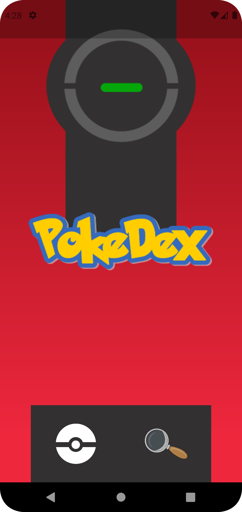
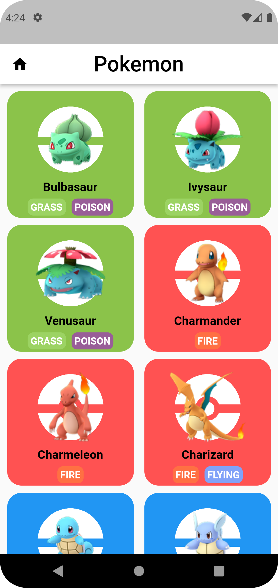
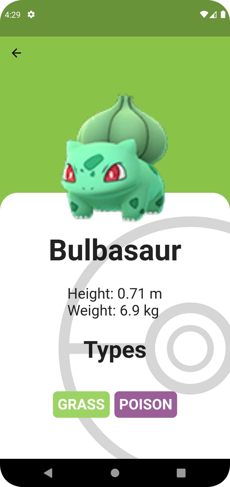

# pokemon_app

## Getting Started

### Pantalla principal

Empezamos con una pantalla de principal con forma de pokedex. Esta pantalla conecta con la lista de pokemons

### Lista de pokemons

En esta pantalla se listan los pokemons en dos columnas.Esto genera una mejor visión de los pokemons en el dispositivo movil. Cada card muestra la imagen, nombre y tipos del pokemon.

### Información del pokemon

Esta pantalla muestra la información del pokemon seleccionado en la lista de pokemons. Se muestra mayor información del pokemon seleccionado.

